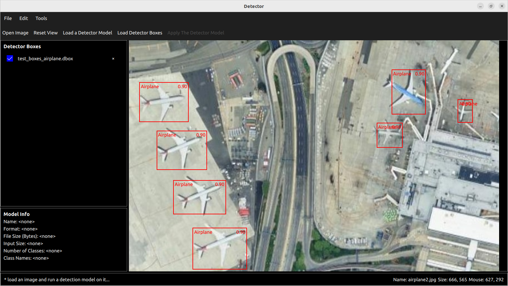

# Detectra

A lightweight desktop tool for visualizing object detection results.

InferView is built with **C++ and Qt/QML** and allows users to load images, run object detection models, and interactively explore the results.

## Features

- Load and display images
- Run object detection models on images
- Visualize **bounding boxes**
- Smooth **zoom and pan navigation**
- Simple and responsive **Qt/QML UI**

## Technologies

- C++
- Qt / QML
- Object Detection inference

## Usage

1. Launch the application.
2. Load an image.
3. Load a trained object detection model.
4. Run inference to see detected objects and bounding boxes.

## Purpose

This project was developed as a **sample application for experimenting with object detection inference and Qt/QML UI development**.

